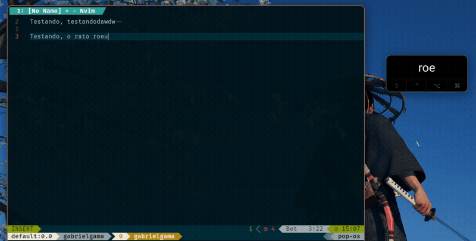

# Key-caster

Lightweight on-screen keystroke displayer for Linux, inspired by KeyCastr for macOS.

Independent project based on the original work by [bm-mit/key-caster](https://github.com/bm-mit/key-caster), modernized and actively maintained for current Linux desktops (Wayland, COSMIC, and X11) with non-root execution, per-device hardware layout routing, and robust device hotplugging.

## Demo



## Prerequisites

To capture global keystrokes without `sudo`, add your user to the system `input` group:

```bash
sudo usermod -aG input $USER
```

Log out and log back in (or restart) for the group membership to take effect.

## Installation

### Via pipx (recommended)

```bash
pipx install git+https://github.com/GabrielBaiano/key-caster.git
```

### From source

```bash
git clone https://github.com/GabrielBaiano/key-caster.git
cd key-caster
python3 -m venv .venv
source .venv/bin/activate
pip install -e .
```

To run directly from source without installing:

```bash
python3 key_caster.py
```

## Usage

```bash
keycaster
```

### Command-line Options

```text
keycaster [options]

  -t, --timeout TIMEOUT       Inactivity timeout in seconds before clearing (default: 2.0, 0 to disable)
  -m, --max-keys MAX_KEYS     Maximum keys displayed simultaneously (default: 5)
  -s, --font-size SIZE        Font size in pixels (default: 32)
  -o, --opacity OPACITY       Overlay opacity between 0.1 and 1.0 (default: 0.92)
  -p, --position POSITION     Preset position: bottom-right, bottom-center, bottom-left, top-right, top-left, top-center, center
  -l, --layout LAYOUT         Keyboard layout: auto, abnt2, us-intl, us (default: auto)
```

## Features

- **Non-root execution**: Runs cleanly as a regular user via the Linux `input` group.
- **Per-Device Layout Routing**: In `auto` mode, keystrokes are automatically mapped based on the physical hardware device. An internal laptop keyboard (ABNT2 / ThinkPad) and an external USB keyboard (US-Intl / ANSI) can be used simultaneously with accurate keycaps and dead keys.
- **Mac Typography**: Renders modifier keys with clean symbols (`⇧`, `⌃`, `⌥`, `⌘`) and action keys (`⌫`, `⌦`, `↩`, `⇥`, `⎋`, `⎙`).
- **Context Menu**: Right-click the overlay to clear keys, toggle auto-hide, change screen position presets, or override keyboard layouts.
- **Draggable**: Click and drag with the left mouse button to place the overlay anywhere on screen.
- **Wayland / COSMIC / X11**: Configured to float cleanly above windows without tiling interference or stealing input focus.

## License & Credits

Distributed under the GNU General Public License v3.0.
Originally created by [bm-mit](https://github.com/bm-mit/key-caster).
